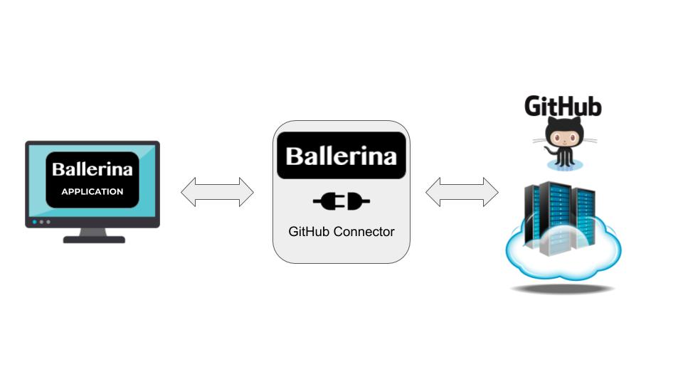

# Ballerina GitHub Connector

###### GitHub brings together the world's largest community of developers to discover, share, and build better software. From open source projects to private team repositories, GitHub is an all-in-one platform for collaborative development.

The Ballerina GitHub connector allow users to access the GitHub API through ballerina. This connector uses the GitHub GraphQL API v4.0

|Ballerina Version | Connector Version | GitHub API Version |
|------------------|-------------------| ------------------ |
|0.970.0-alpha1-SNAPSHOT | 0.970.0-alpha1-SNAPSHOT | v4



### Getting started

* Clone the repository by running the following command
```
git clone https://github.com/wso2-ballerina/package-github
```
* Import the package to your ballerina project.

##### Prerequisites
Download the ballerina [distribution](https://ballerinalang.org/downloads/).

### Working with GitHub Connector Actions

All the actions return `objects` or `github4:GitConnectorError`. If the action was a success, then the requested object will be returned while the `github:GitConnectorError` will be **null** and vice-versa.

##### Example
* Request 
```ballerina
    import github4;

    public function main (string[] args) {
        endpoint github4:Client githubEP {
            accessToken:getAccessToken(),
            clientEndpointConfiguration: {}
        };
    
        github4:Repository repository = {};
        var repo = githubEP -> getRepository("wso2-ballerina/package-github");
        match repo {
            github4:Repository rep => {
                repository = rep;
            }
            github4:GitConnectorError err => {
                io:println(err);
            }
        }
    
        io:println(repository);
    }
    
```

* Response object
```ballerina
public type Repository {
    string id;
    string name;
    string createdAt;
    string updatedAt;
    string description;
    int forkCount;
    boolean hasIssuesEnabled;
    boolean hasWikiEnabled;
    string homepageUrl;
    boolean isArchived;
    boolean isFork;
    boolean isLocked;
    boolean isMirror;
    boolean isPrivate;
    string license;
    string lockReason;
    string mirrorUrl;
    string url;
    string sshUrl;
    RepositoryOwner owner;
    Language primaryLanguage;
}
```

***
## Connector API

### API Reference
- [getRepository()](#getrepository)
    - [getProjectList()](#getprojectlist)
    - [getProject()](#getproject)
    - [getIssueList()](#getissuelist)
    - [getPullRequestList()](#getpullrequestlist)

- [getOrganization()](#getorganization)
    - [getProjectList()](#getprojectlist-1)
    - [getProject()](#getproject-1)
    - [getRepositoryList()](#getrepositorylist)
    
### getRepository()
Return a single repository.

###### Parameters
Name | Type | Description
-----|------|------------
name | string | Name of the organization and repository. (Eg: "organization/repository")

###### Returns
* **github:Repositgithub4or **github:GitConngithub4rror**

***

### getOrganization()
Return a single organization.

###### Parameters
Name | Type | Description
-----|------|------------
name | string | Name of the organization. (Eg: "organization")

###### Returns
**github:Organizgithub4* or **github:GitConngithub4rror**

***
## github:Repositgithub4## getProjectList()
Return a list of projects in the repository.

###### Parameters
Name | Type | Description
-----|------|------------
state | string | The state of the project. (Eg: github:GIT_STAgithub4N, github:GIT_STAgithub4SED, github:GIT_STAgithub4 )

###### Returns
**github:Projectgithub4 or **github:GitConngithub4rror**

***
### getProject()
Return a single project of the repository.

###### Parameters
Name | Type | Description
-----|------|------------
projectNumber | int | The integral number of the project.

###### Returns
**github:Projectgithub4**github:GitConngithub4rror**

***

### getIssueList()
Return a list of issues of the repository.

###### Parameters
Name | Type | Description
-----|------|------------
state | string | The state of the issue. (Eg: github:GIT_STAgithub4N, github:GIT_STAgithub4SED, github:GIT_STAgithub4 )

###### Returns
**github:IssueLigithub4r **github:GitConngithub4rror**

***

### getPullRequestList()
Return a list of pull requests of the repository.

###### Parameters
Name | Type | Description
-----|------|------------
state | string | The state of the pull request. (Eg: github:GIT_STAgithub4N, github:GIT_STAgithub4SED, github:GIT_STAgithub4GED, github:GIT_STAgithub4)

###### Returns
**github:PullReqgithub4st** or **github:GitConngithub4rror**

***

## github:Organizgithub4
### getProjectList()
Return a list of projects on the organization.

###### Parameters
Name | Type | Description
-----|------|------------
state | string | The state of the project. (Eg: github:GIT_STAgithub4N, github:GIT_STAgithub4SED, github:GIT_STAgithub4 )

###### Returns
**github:Projectgithub4 or **github:GitConngithub4rror**

***

### getProject()
Return a single project of the organization.

###### Parameters
Name | Type | Description
-----|------|------------
projectNumber | int | The integral number of the project.

###### Returns
**github:Projectgithub4**github:GitConngithub4rror**

***

### getRepositoryList()
Return the list of repositories of the organization.

###### Parameters
None

###### Returns
**github:Repositgithub4t** or **github:GitConngithub4rror**

***

## github:Projectgithub4getColumnList()
Return a list of columns in the project.

###### Parameters
None

###### Returns
**github:ColumnLgithub4
***

## github:Column
github4etCardList()
Return a list of cards in the column.

###### Parameters
None

###### Returns
**github:CardLisgithub4**
## github:Repositgithub4t

### getAllRepositories()
Return an array of repositories.

###### Parameters
None

###### Returns
**github:Repositgithub4*

***

### nextPage()
Return the next page of the repository list.

###### Parameters
None

###### Returns
**github:Repositgithub4t** or **github:GitConngithub4rror**

***

### hasNextPage()
Check if there is another page for the repository list.

###### Parameters
None

###### Returns
**boolean**

***

### hasPreviousPage()
Check if there is a previous page for the repository list.

###### Parameters
None

###### Returns
**boolean**

***

## github:ColumnLgithub4## getAllColumns()
Return an array of columns.

###### Parameters
None

###### Returns
**github:Column[github**
### nextPage()
Return the next page of the column list.

###### Parameters
None

###### Returns
**github:ColumnLgithub4or **github:GitConngithub4rror**

***
### hasNextPage()
Check if there is another page for the column list.

###### Parameters
None

###### Returns
**boolean**

***

### hasPreviousPage()
Check if there is a previous page for the column list.

###### Parameters
None

###### Returns
**boolean**

***

## github:CardLisgithub4 getAllCards()
Return an array of cards.

###### Parameters
None

###### Returns
**github:Card[]*github

### nextPage()
Return the next page of the card list.

###### Parameters
None

###### Returns
**github:CardLisgithub4 **github:GitConngithub4rror**

***
### hasNextPage()
Check if there is another page for the card list.

###### Parameters
None

###### Returns
**boolean**

***

### hasPreviousPage()
Check if there is a previous page for the card list.

###### Parameters
None

###### Returns
**boolean**

***
