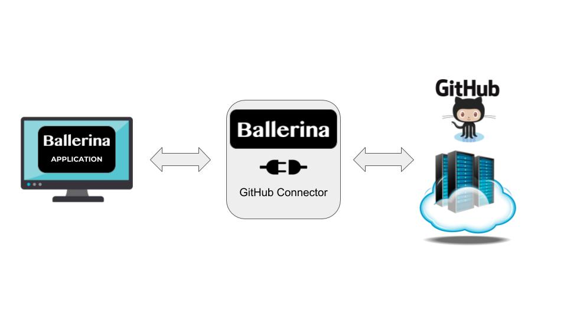

[](https://travis-ci.org/wso2-ballerina/module-github)

# Ballerina GitHub Endpoint

###### GitHub brings together the world's largest community of developers to discover, share, and build better software. From open source projects to private team repositories, GitHub is an all-in-one platform for collaborative development.

GitHub connector provides a Ballerina API to access the GitHub GraphQL API. 
The connector has built-in support to handle OAuth2.0, provides auto completion and type conversions. The following 
sections explains how to use Ballerina GitHub4 connector. You can refer the [GitHub GraphQL API v4.0]
(https://developer.github.com/v4/) to learn more about the API. 

| Ballerina Version | GitHub API Version |
|-------------------|--------------------|
| 1.1.0             | v4                 |



##### Prerequisites
Download the ballerina [distribution](https://ballerinalang.org/downloads/).

### Getting started

* Clone the repository by running the following command
```shell
git clone https://github.com/wso2-ballerina/module-github
```

* Initialize the ballerina project.
```shell
ballerina init
```

### Working with GitHub Endpoint Actions

All the actions return a `record` or an `object`, or an `error`. If the action was a success, then the requested `object` or `record` will be returned while the `error` will be **empty** and vice-versa.

##### Example
* Request

```ballerina
import ballerina/config;
import ballerina/http;
import ballerina/io;
import wso2/github4;

github4:GitHubConfiguration gitHubConfig = {
    accessToken: "access_token"
};
 
github4:Client githubClient = new (gitHubConfig);

public function main() {
    github4:Repository|error result = githubClient->getRepository("wso2-ballerina/module-github");
    if (result is github4:Repository) {
        io:println("Repository wso2-ballerina/module-github: ", result);
    } else {
        io:println("Error occurred on getRepository(): ", result);
    }
}
```

* The type descriptor of the `record` that will be returned on success
```ballerina
public type Repository record {
    string id = "";
    string name = "";
    string createdAt = "";
    string updatedAt = "";
    string description = "";
    int forkCount = 0;
    boolean hasIssuesEnabled = false;
    boolean hasWikiEnabled = false;
    boolean isArchived = false;
    boolean isFork = false;
    boolean isLocked = false;
    boolean isMirror = false;
    boolean isPrivate = false;
    string homepageUrl = "";
    string lockReason = "";
    string mirrorUrl = "";
    string url = "";
    string sshUrl = "";
    RepositoryOwner owner = {};
    Language primaryLanguage = {};
    int stargazerCount = 0;
}
```

***

# Ballerina GitHub Webhook

The Ballerina GitHub webhook registers a [GitHub webhook](https://developer.github.com/webhooks/) to subscribe to 
notifications on the occurrence of events, and starts up a callback service, which will receive notification requests.

| Ballerina Version | GitHub API Version |
|-------------------|--------------------|
| 1.1.0             | v3                 |

```ballerina
import ballerina/http;
import ballerina/io;
import ballerina/oauth2;
import ballerina/websub;
import wso2/githubwebhook3;

listener githubwebhook3:Listener githubListener = new (8080);

oauth2:OutboundOAuth2Provider githubOAuth2Provider = new ({
    accessToken: "<GH_ACCESS_TOKEN>"
});
http:BearerAuthHandler githubOAuth2Handler = new (githubOAuth2Provider);

@websub:SubscriberServiceConfig {
   path: "/webhook",
   subscribeOnStartUp: true,
   target: [githubwebhook3:HUB, "https://github.com/<GH_USERNAME>/<GH_REPO_NAME>/events/*.json"],
   hubClientConfig: {
       auth: {
           authHandler: githubOAuth2Handler
       }
   },
   callback: "<CALLBACK_URL>"
}
service githubWebhook on githubListener {

    resource function onPing(websub:Notification notification, githubwebhook3:PingEvent event) {
        io:println("[onPing] Webhook Registered: ", event);
    }

    resource function onIssuesOpened(websub:Notification notification, githubwebhook3:IssuesEvent event) {
        io:println("[onIssuesOpened] Issue ID: ", event.issue.number);
    }

    resource function onWatch(websub:Notification notification, githubwebhook3:WatchEvent event) {
        io:println("[onWatch] Repository starred by: ", event.sender);
    }
}
```

Every time an issue is opened in the repository or when the repository is starred, a content delivery request 
will be received at the relevant resource.
***
